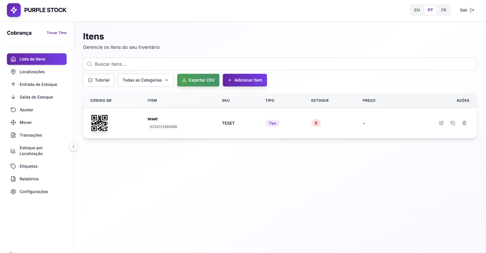

# Purple Stock (Next.js)

Sistema multi-tenant de gestão de estoque com times, localizações, itens, movimentações e relatórios.



## Stack

- Next.js 16 (App Router)
- React 18 + TypeScript
- Tailwind CSS + shadcn/ui
- SQLite/libSQL (`@libsql/client`, Turso em produção) + Drizzle ORM
- Jest para testes

## Arquitetura

O projeto segue separação explícita de camadas:

- `src/app/*`: páginas e API Routes (adapters HTTP/UI).
- `src/lib/services/*`: regras de negócio, autorização e contratos de saída.
- `src/lib/db/*`: acesso a dados (queries Drizzle/SQLite).
- `src/db/*`: schema, cliente e migrações.

Fluxo padrão de API:

1. Route handler valida params e body bruto.
2. Route delega para um serviço em `src/lib/services/*`.
3. Serviço valida payload, autoriza e chama `src/lib/db/*`.
4. Route responde usando helpers de `src/lib/api-route.ts`.

Guardrails automáticos (CI e hook) impedem violações arquiteturais.

## Funcionalidades principais

- Autenticação por cookie assinado (`ps_session`).
- Multi-tenancy por time e membership ativo.
- CRUD de times, usuários do time, itens e localizações.
- Movimentações de estoque (`stock_in`, `stock_out`, `adjust`, `move`, `count`) com atomicidade.
- Relatórios consolidados por time.
- PWA com `manifest.json` e service worker.
- i18n local (`pt-BR`, `en`, `fr`).

## Estrutura de pastas

```txt
src/
  app/
    (main)/, (auth)/              # páginas
    teams/[id]/*                  # features por time
    api/*                         # rotas HTTP
  components/
    ui/*                          # base UI
    shared/*                      # blocos reutilizáveis
  lib/
    services/*                    # casos de uso
    db/*                          # consultas por domínio
    contracts/schemas.ts          # parse/validação de payload
    permissions.ts                # autorização
  db/
    schema.ts                     # tabelas e relações
    migrations/*.sql              # migrações SQL
```

## Requisitos

- Node.js 20+ (alinhado com CI).
- npm.

## Variáveis de ambiente

- `DATABASE_URL`: URL libSQL (`libsql://...`) para Turso. Em local, use `file:./src/db.sqlite`.
- `TURSO_AUTH_TOKEN` (obrigatório para Turso remoto): token do banco Turso.
- `SESSION_SECRET` (obrigatório em produção): segredo para assinatura da sessão.
- `STRIPE_SECRET_KEY` (obrigatório para billing): chave secreta da Stripe.
- `STRIPE_PRICE_ID` (obrigatório para billing): `price_id` do plano mensal por time.
- `STRIPE_WEBHOOK_SECRET` (obrigatório para webhook): segredo do endpoint de webhook.
- `APP_URL` ou `NEXT_PUBLIC_APP_URL` (recomendado): URL base usada em retornos do Checkout/Portal.

## Setup local

```bash
npm install
npm run db:migrate
npm run dev
```

Aplicação em `http://localhost:3000`.

Para Turso (remoto), configure:

```bash
DATABASE_URL=libsql://<seu-db>-<org>.turso.io
TURSO_AUTH_TOKEN=<seu_token_turso>
```

## Scripts

- `npm run dev`: ambiente de desenvolvimento.
- `npm run build`: build de produção.
- `npm run start`: sobe build de produção.
- `npm run test`: suíte completa.
- `npm run test:watch`: watch mode.
- `npm run test:coverage`: cobertura.
- `npm run db:migrate`: aplica SQLs de `src/db/migrations`.
- `npm run db:rollback -- --steps=1`: faz rollback das últimas migrações aplicadas (requer arquivos `*.down.sql` correspondentes).
- `npm run db:new -- <nome>`: cria par de migration `up/down` com próximo prefixo numérico.
- `npm run verify:architecture`: checks arquiteturais + política de testes + lint de arquitetura + testes de arquitetura.
- `npm run prepush:required`: validação obrigatória pré-push (`verify:architecture` + `build`).
- `npm run prepush:full`: validação completa pré-push (`verify:architecture` + `test --runInBand` + `build`).
- `npm run hooks:install`: ativa `.githooks/pre-push`.
- `npm run hooks:uninstall`: remove hook local.

## Deploy no Amplify (Next SSR + Turso)

Este repositório usa `amplify.yml` para gerar `.env.production` no build do Next.js.

### Variáveis obrigatórias no Amplify

Configure em **Hosting > Environment variables** (obrigatórias para o build SSR):

- `DATABASE_URL`
- `TURSO_AUTH_TOKEN`
- `SESSION_SECRET`
- `STRIPE_SECRET_KEY`
- `STRIPE_WEBHOOK_SECRET`
- `APP_URL`
- `STRIPE_PRICE_ID`
- `STRIPE_PUBLISHABLE_KEY`

Observação: mesmo usando **Hosting > Secrets**, o build SSR do Next pode precisar das variáveis em `Environment variables` para coleta de page data.

### Fluxo de deploy recomendado

1. Atualizar variáveis no Amplify.
2. Executar **Clear cache and redeploy**.
3. Validar login (`/api/auth/login`) e signup (`/api/auth/signup`).

### Troubleshooting rápido

- Erro `DATABASE_URL must be set in production`:
  - `DATABASE_URL` não está chegando no build/runtime SSR.
- Erro `TURSO_AUTH_TOKEN must be set...`:
  - token ausente no ambiente de produção.
- Erro `SERVER_ERROR: 401` na conexão Turso:
  - token inválido/expirado; gere novo token e atualize o ambiente.

## Padrão de migrations (up/down)

Para cada migration `up`, crie um arquivo `down` correspondente no mesmo diretório `src/db/migrations`.

- `NNN_nome_da_migration.sql`: aplica mudança.
- `NNN_nome_da_migration.down.sql`: desfaz mudança.

Exemplo:

- `004_add_items_status.sql`
- `004_add_items_status.down.sql`

Para gerar automaticamente o par de arquivos:

```bash
npm run db:new -- add_items_status
```

Fluxo recomendado:

1. Criar o `up` com alteração incremental.
2. Criar o `down` revertendo exatamente a alteração do `up`.
3. Executar `npm run db:migrate`.
4. Testar reversão com `npm run db:rollback -- --steps=1`.

Observação: existe script `db:seed` no `package.json`, mas o arquivo `src/db/seed.ts` não está presente no repositório atual.

## Endpoints principais

- `POST /api/auth/signup`
- `POST /api/auth/login`
- `POST /api/auth/logout`
- `GET|POST /api/teams`
- `GET|PUT|DELETE /api/teams/:id`
- `GET|POST /api/teams/:id/items`
- `GET|PUT|DELETE /api/teams/:id/items/:itemId`
- `GET|POST /api/teams/:id/locations`
- `GET|PUT|DELETE /api/teams/:id/locations/:locationId`
- `GET|POST /api/teams/:id/stock-transactions`
- `GET /api/teams/:id/reports`
- `GET /api/teams/:id/transactions`
- `DELETE /api/teams/:id/transactions/:transactionId`
- `POST /api/teams/:id/billing/checkout`
- `POST /api/teams/:id/billing/portal`
- `POST /api/stripe/webhook`

## Qualidade e CI

- Hook de pre-push executa `npm run prepush:required`.
- Quando o ambiente local estiver alinhado para testes nativos, rode também `npm run prepush:full` antes do push.
- GitHub Actions:
  - job `architecture`: `npm ci` + `npm run verify:architecture`.
  - job `validate`: `npm ci` + `npm test -- --runInBand` + `npm run build`.
